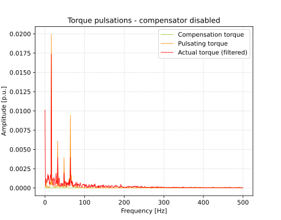

# torque-ripple-rl
This repository contains gym interface that can be utilized for prototyping. The interface is built for underlying C++ simulator, which is not distributed.

## pulsar.py
Torque pulsation can be learned and then compensated. The agent in `pulsar.py` learns simulated pulsations using Q-learning algorithm and then reduces the torque ripple. Figures below visualize the progress after training 0, 500, 2000 and 4900 episodes.

    
     
    
    

### Reward history  

### Compensation performance
The compensation performance depends heavily on discretization. With seven actions, as shown in gifs, the torque ripple reduction is already very noticeable:

    
     

## Installation
`activate virtuan environment`  
`pip install -e ilmarinen_gym/`
