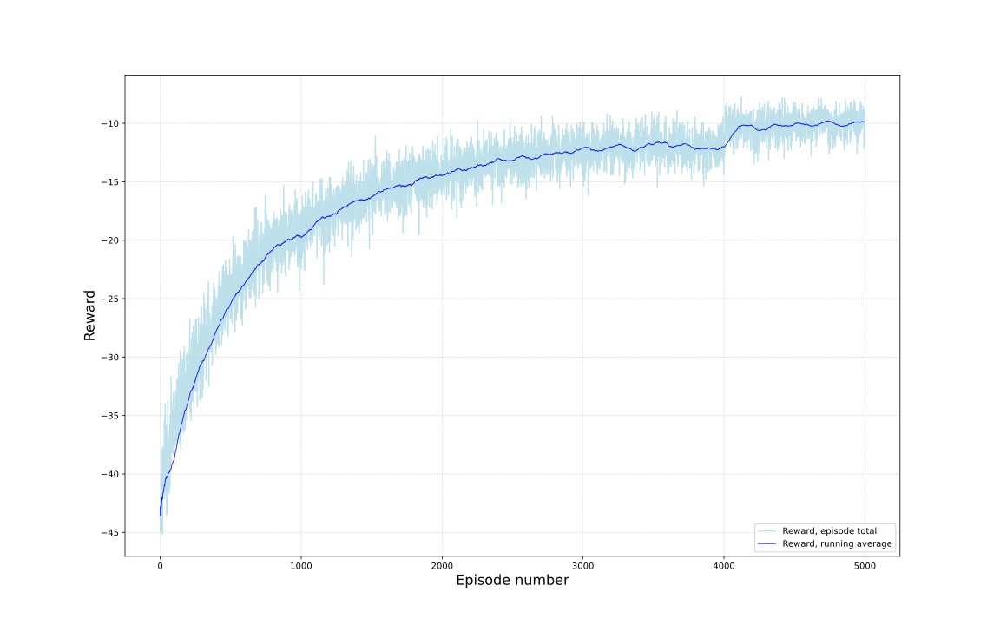

# torque-ripple-rl
This repository contains gym interface that can be utilized for prototyping. The interface is built for underlying C++ simulator, which is not distributed further. Because the code in this repository cannot be run, this readme aims to explain what the files are about.

## Torque pulsations
Torque pulsation can be learned and compensated. The agent in `pulsar.py` learns modelled pulsations using reinforcement learning algorithm and then reduces the torque pulsations by injecting compensation torque. Figures below visualize the progress after training for 0, 500, 2000 and 4900 episodes.

    
     
    
    

### Reward history  
The reward corresponds torque error. The reward approaches zero, thus the torque error must be getting constantly smaller. This allows us to conclude that the agent learns to compensate inherent torque pulsations to some extent. The agent will never be able to reach zero with discrete actions, as these are only rough approximations of required compensation values.

### Compensation policy  
System states can be defined using rotor angle, which allows compensation values to be given with respect to the electrical angle of the rotor. After training, only rotor angle must be known in order to succesfully compensate pulsations.

### Compensation performance  
The compensation performance depends heavily on discretization step size. However, with only seven actions, the torque ripple reduction is already very noticeable in simulations.

    
     

## Installation
Just reminder for myself. Don't bother to try install...  
`activate virtual environment`  
`pip install -e ilmarinen_gym/`  
