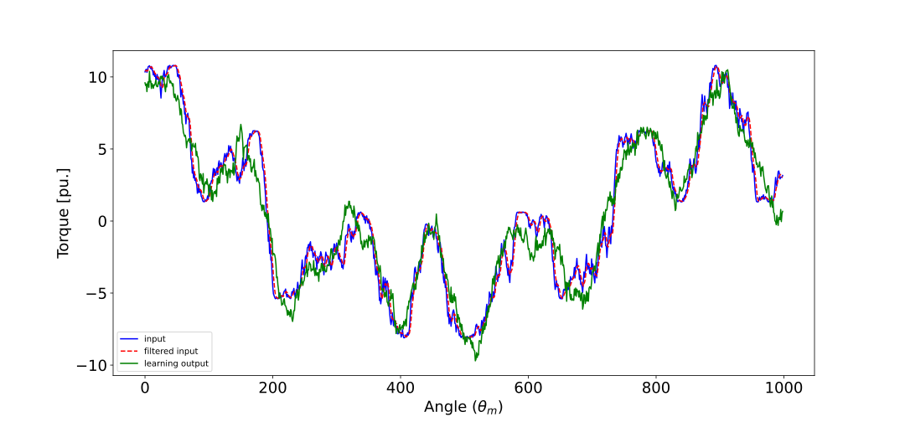

#  Convolutional neaural network based compensator
To train the compensator, run `python train.py`.
For more clear visualizations, you may train inverted model: `python train.py --steps 20 --invert`. With inverted model, the train output should look like the input signal. Visualizations can be found from predictions `folder/` after training.

Exampel prediction with trained model:

