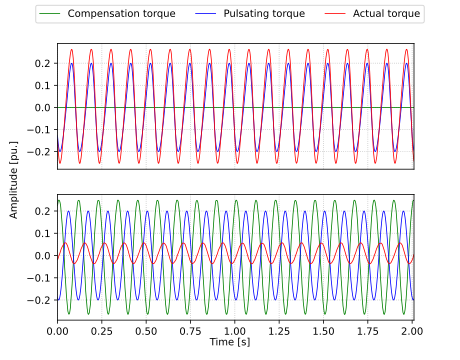

# Iterative learning control (ILC)
With constant speed, every rotation is approximately similar. This allows periodical disturbances to be identified iteratively. When identification is done with respect to rotor angle, it is quite trivial to inject an oppsing force, that negates the disturbances occuring in the system.

The following simulation shows how ILC is capable of reducing undesired 6th torque harmonic. In the lower plot, the actual torque has much smaller variation than in the upper plot where compensator is disabled.

