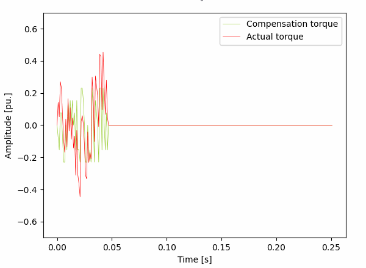
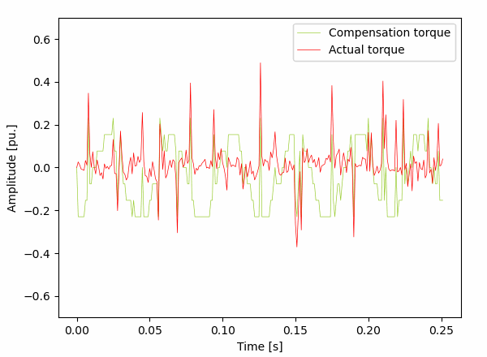
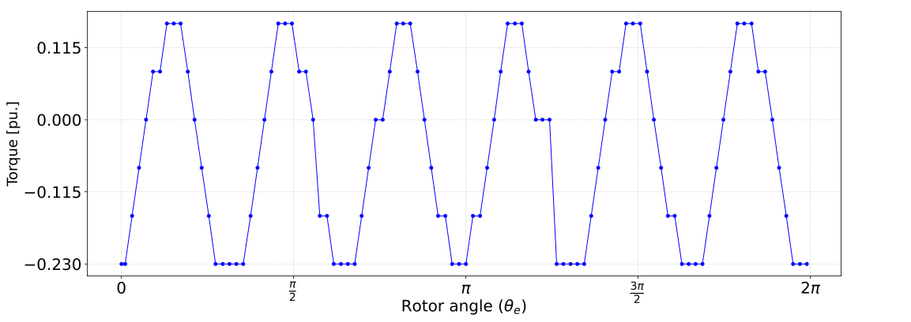

# Q-learning
Q-learning based compensator is trained using a lumped-element control simulator (written in C++). The simulator is not publicly available, so scripts in this directory cannot be unfortunately tested. Following sections briefly decribe the idea.

## Torque pulsations
Torque pulsation can be learned and compensated. Q-learning algorithm in `train.py` is used to learn the shape and amplitude of torque pulsations. After learning, it is possible to inject similar harmonics back to the system, so that actual torque gets reduced. Figures below visualize the disturbance identification and compensation progress, after training for 0, 500, 2000 and 4900 episodes.

    
     
    
    

## Compensation policy  
System states can be defined using rotor angle, which allows compensation values to be given with respect to the electrical angle of the rotor. After training, only the rotor angle must be known in order to succesfully produce compensating torque for certain system.

## Compensation performance  
The compensation performance depends heavily on discretization step size. Nonetheless, with only seven action steps, the torque ripple reduction is already very noticeable in simulations. In the left plot, the actual torque is much greater than in the right plot where compsating torque is applied. Orange signal shows the torque that is applied to the system in simulations, as inherent torque pulsations have to be modelled somehow.

    
     

## Reward history  
The reward is given based on torque error. In reward history plot, the reward clearly approaches zero. Therefore, torque error must be also getting constantly smaller. This allows us to conclude that the agent can learn to compensate inherent torque pulsations. The previous frequency domain plots validate this conclusion, as the problematic harmonics did get reduced when the compensator was enabled.

